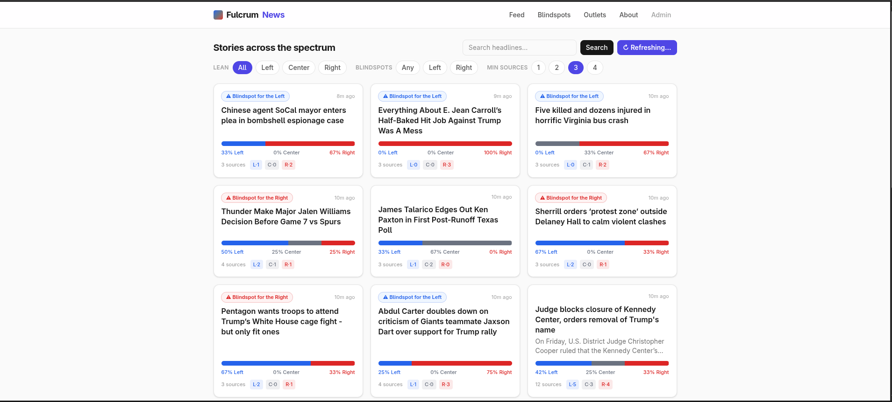
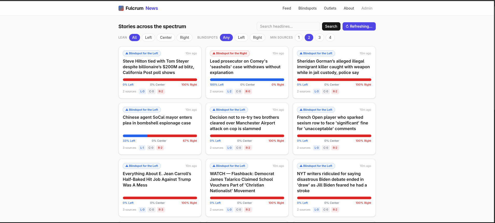
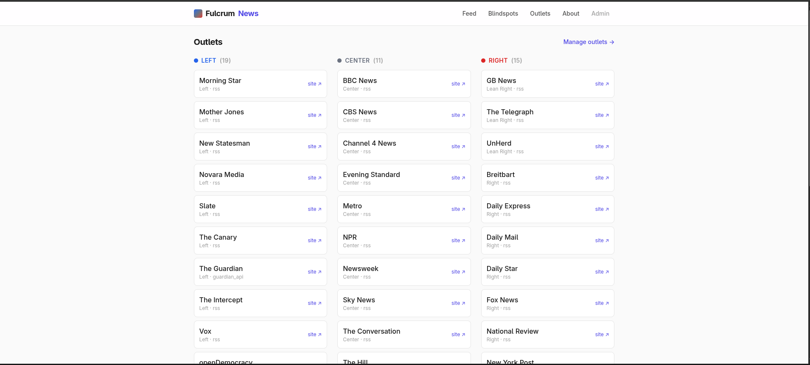

# FulcrumNews

An open-source, self-hostable [Ground News](https://ground.news/) alternative.

FulcrumNews ingests the same news story across outlets from across the political
spectrum, clusters the articles that cover the **same event**, shows a
**left / center / right** bias-distribution bar and a **"Blindspot"** flag when one
side under-covers a story, and lets you read either a neutral **AI briefing**
synthesized across all outlets or each outlet's **plaintext** article.

Built with **Quart** (async), **LangGraph** + **LangChain** (→ OpenRouter),
**SQLite + Tortoise ORM**, **LanceDB** (vectors), **Trafilatura** ingestion, and
**Tailwind v4** (no Node).

---

## Screenshots

### The feed — stories across the spectrum
Each clustered story shows a left/center/right bias bar, a Blindspot badge when one
side under-covers it, and per-bucket source counts. Filter by lean, blindspots, and
minimum sources.



### Blindspots
Surface stories that one side of the spectrum is under-reporting.



### Outlets
The roster grouped by political lean — fully editable from the admin UI.



---

## Requirements

- **Python ≥ 3.14**
- [`uv`](https://docs.astral.sh/uv/) (used for dependency management & running)
- An **OpenRouter API key** — <https://openrouter.ai/keys>
- *(optional)* a free **Guardian Open Platform** key — <https://open-platform.theguardian.com/access/>
  (without it, the Guardian outlet is auto-disabled; the RSS outlets still work)

---

## Quick start

```bash
# 1. Install dependencies (into .venv)
uv sync --extra dev          #  or:  make install

# 2. Configure secrets
cp .env.example .env
#    then edit .env and set OPENROUTER_API_KEY=...   (GUARDIAN_API_KEY optional)

# 3. Build the stylesheet (downloads a standalone Tailwind binary on first run)
make css

# 4. Ingest the news: fetch → cluster → bias/blindspot → AI summaries
make ingest                  #  (takes a few minutes; calls OpenRouter)

# 5. Run the app
make run                     #  serves on http://localhost:8000
```

Open <http://localhost:8000>.

> **First run with no data?** The feed only shows stories corroborated by **2+
> outlets**. Hit **Refresh feeds** on the feed (or `make ingest`) and give it a
> minute, or lower the "Min sources" filter to `1` to see everything.

### Running without `make`

```bash
uv run tailwindcss -i src/fulcrumnews/static/css/input.css \
                   -o src/fulcrumnews/static/css/output.css --minify   # build CSS
uv run python -m fulcrumnews.graph.pipeline                            # ingest
uv run python -m fulcrumnews                                           # serve
```

### Live CSS while developing

In a second terminal: `make css-watch` (rebuilds `output.css` on template changes).

---

## Using it

- **Feed (`/`)** — clustered stories, each with a bias bar, blindspot badge, and
  source chips. Filter by **lean**, **blindspots**, and **minimum sources**; search
  headlines; and **Refresh feeds** to reprocess everything on demand.
- **Story (`/story/<slug>`)** — an **AI Summary** tab (neutral briefing + key points +
  how coverage differs) and one **plaintext tab per outlet**, ordered left → right.
- **Outlets (`/outlets`)** — the roster grouped by lean.
- **Admin (`/admin`)** — trigger a refresh and **manage outlets**: add/edit/delete an
  RSS outlet, classify its lean, and **Verify** the feed (a dry run that confirms the
  URL is reachable, parses, and yields extractable article text) *before* saving.
  Protect it by setting `ADMIN_TOKEN` in `.env`.
- **API** — `GET /api/stories`, `GET /api/stories/<id>` (JSON; same filters as the feed).

---

## How it works

A LangGraph pipeline runs on a schedule (and on demand):

```
fetch_sources → extract_bodies → embed → cluster
   → assign_clusters → compute_bias_blindspot → summarize_cluster
```

- **Fetch** — the Guardian via its Open Platform API (full body text); everyone else
  via RSS (`feedparser`) + **Trafilatura** full-text extraction.
- **Embed** — each new article's title + lead is embedded with
  `qwen/qwen3-embedding-4b` (OpenRouter) and stored in **LanceDB**.
- **Cluster** — *hybrid matching*: very-similar embeddings merge outright; borderline
  ones must also share significant **title keywords**, within a rolling time window.
  Incremental across refreshes.
- **Blindspot** — distinct outlets are bucketed left/center/right; a side is flagged a
  blindspot when it falls below `BLINDSPOT_MIN_SOURCES` or `BLINDSPOT_MIN_SHARE`.
- **Summarize** — for multi-outlet stories, `moonshotai/kimi-k2.6` writes a neutral
  cross-outlet briefing.

Lean ratings are a consensus of **AllSides**, **Media Bias/Fact Check**, and
**Ad Fontes Media**.

---

## Configuration (`.env`)

| Key | Default | Notes |
|---|---|---|
| `OPENROUTER_API_KEY` | — | **required** |
| `CHAT_MODEL` | `moonshotai/kimi-k2.6` | briefing model |
| `EMBEDDING_MODEL` | `qwen/qwen3-embedding-4b` | clustering embeddings |
| `EMBEDDING_DIM` | `2560` | must match the model; LanceDB table is fixed at this width |
| `EMBEDDINGS_BASE_URL` / `EMBEDDINGS_API_KEY` | OpenRouter | optional: use a different OpenAI-compatible embeddings provider |
| `GUARDIAN_API_KEY` | — | optional; empty disables the Guardian outlet |
| `CLUSTER_DISTANCE_THRESHOLD` | `0.40` | loose cosine-distance band |
| `CLUSTER_STRICT_DISTANCE` | `0.25` | merge with no keyword check below this |
| `CLUSTER_MIN_TITLE_OVERLAP` | `2` | shared title keywords required in the loose band |
| `CLUSTER_WINDOW_HOURS` | `36` | only cluster within this window |
| `BLINDSPOT_MIN_SOURCES` / `BLINDSPOT_MIN_SHARE` | `2` / `0.15` | blindspot thresholds |
| `REFRESH_INTERVAL_HOURS` | `3` | background refresh cadence |
| `ADMIN_TOKEN` | — | gates `/admin`; **set this for any real deployment** |
| `HOST` / `PORT` | `0.0.0.0` / `8000` | server bind |

---

## Make targets

| Target | Action |
|---|---|
| `make install` | install deps (incl. dev) |
| `make css` / `make css-watch` | build / watch the Tailwind stylesheet |
| `make db-init` | create the schema + seed the default roster |
| `make ingest` | run one full pipeline pass |
| `make run` | serve the app |
| `make test` | run the test suite |
| `make lint` | ruff |

---

## Notes & limitations

- **Reuters & AFP are intentionally excluded** — they offer no free/legal feed (paid
  licensed APIs only; scraping prohibited). Add any outlet with a public RSS feed via
  the admin UI.
- Some outlets (e.g. The Telegraph) **paywall article bodies** (HTTP 402); they're
  defined but disabled by default since only headlines/snippets are extractable.
- The AI briefings are **model-generated and may contain errors** — always read the
  outlets directly (one tab each on every story page).
- SQLite runs in **WAL** mode; the scheduled refresh is **single-flight** (overlapping
  runs are skipped).

## License

MIT.
